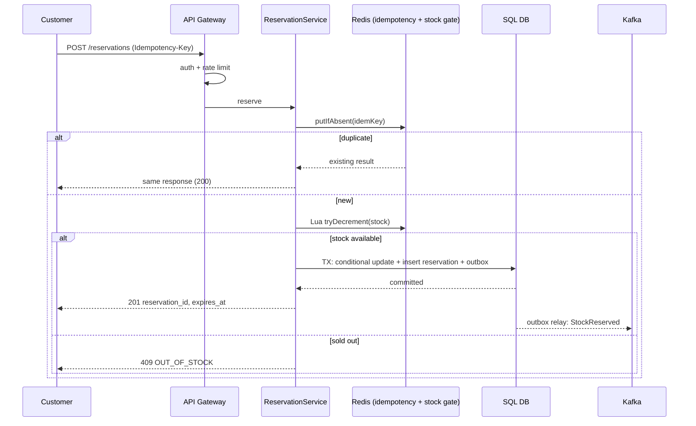
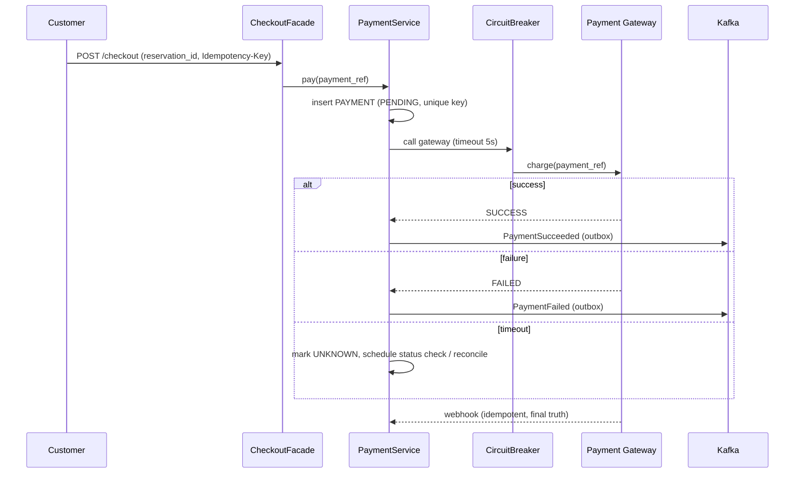
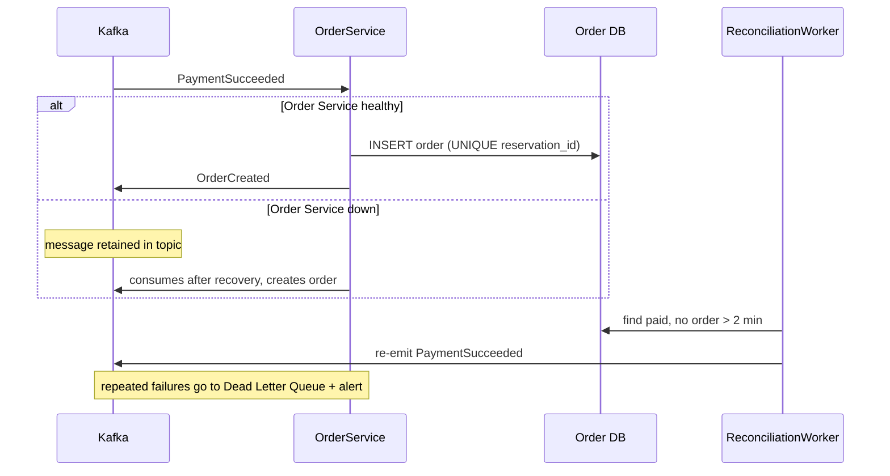

# Sequence Diagrams

## 1. Purchase and reservation

```mermaid
sequenceDiagram
  participant U as Customer
  participant G as API Gateway
  participant R as ReservationService
  participant X as Redis (idempotency + stock gate)
  participant D as SQL DB
  participant K as Kafka
  U->>G: POST /reservations (Idempotency-Key)
  G->>G: auth + rate limit
  G->>R: reserve
  R->>X: putIfAbsent(idemKey)
  alt duplicate
    X-->>R: existing result
    R-->>U: same response (200)
  else new
    R->>X: Lua tryDecrement(stock)
    alt stock available
      R->>D: TX: conditional update + insert reservation + outbox
      D-->>R: committed
      R-->>U: 201 reservation_id, expires_at
      D-->>K: outbox relay: StockReserved
    else sold out
      R-->>U: 409 OUT_OF_STOCK
    end
  end
```

## 2. Payment

```mermaid
sequenceDiagram
  participant U as Customer
  participant C as CheckoutFacade
  participant P as PaymentService
  participant B as CircuitBreaker
  participant PG as Payment Gateway
  participant K as Kafka
  U->>C: POST /checkout (reservation_id, Idempotency-Key)
  C->>P: pay(payment_ref)
  P->>P: insert PAYMENT (PENDING, unique key)
  P->>B: call gateway (timeout 5s)
  B->>PG: charge(payment_ref)
  alt success
    PG-->>P: SUCCESS
    P->>K: PaymentSucceeded (outbox)
  else failure
    PG-->>P: FAILED
    P->>K: PaymentFailed (outbox)
  else timeout
    P->>P: mark UNKNOWN, schedule status check / reconcile
  end
  PG-->>P: webhook (idempotent, final truth)
```

## 3. Order creation and recovery

```mermaid
sequenceDiagram
  participant K as Kafka
  participant O as OrderService
  participant D as Order DB
  participant W as ReconciliationWorker
  K->>O: PaymentSucceeded
  alt Order Service healthy
    O->>D: INSERT order (UNIQUE reservation_id)
    O->>K: OrderCreated
  else Order Service down
    Note over K: message retained in topic
    O->>K: consumes after recovery, creates order
  end
  W->>D: find paid, no order > 2 min
  W->>K: re-emit PaymentSucceeded
  Note over O,K: repeated failures go to Dead Letter Queue + alert
```
